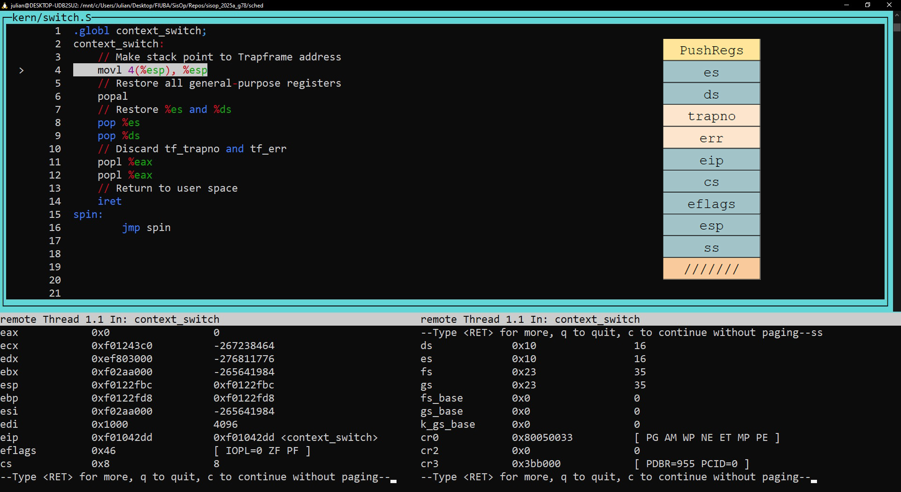
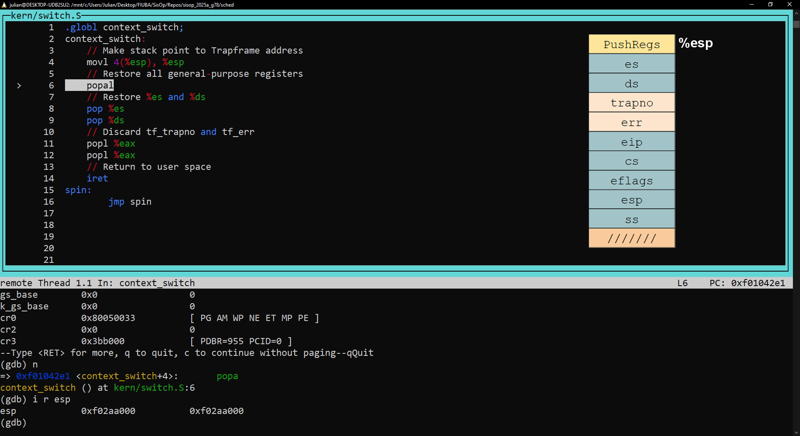
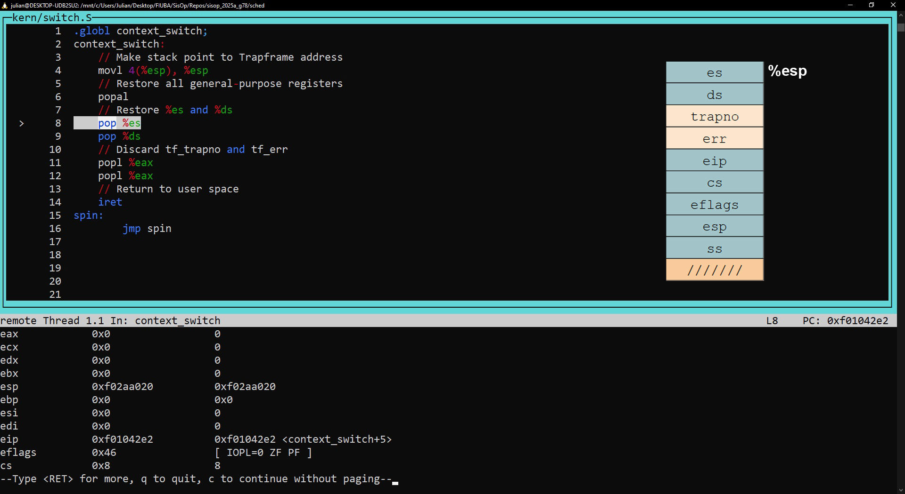
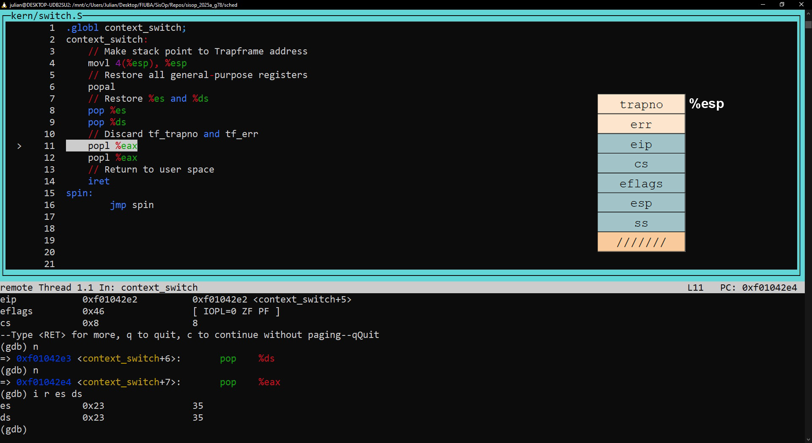
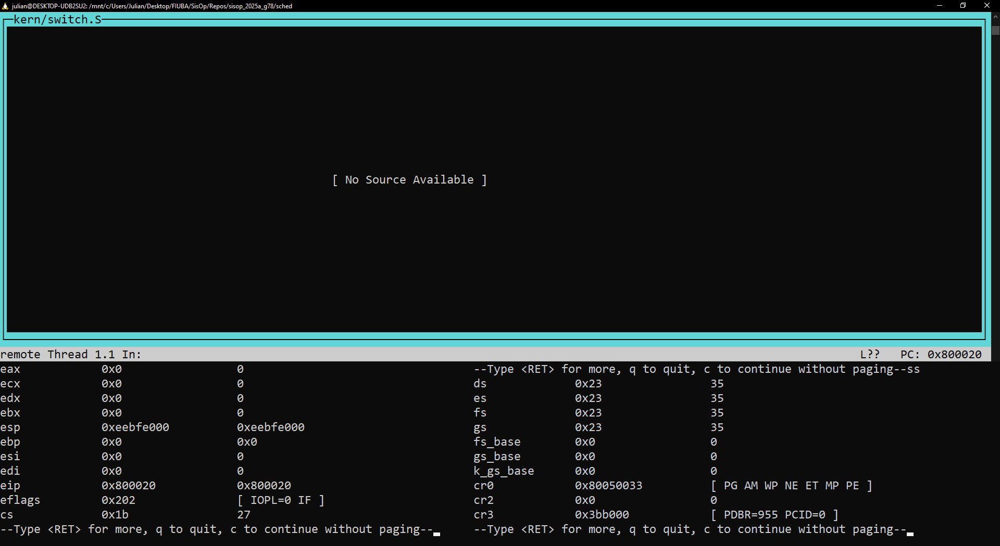

# sched

### Parte 1: Context switch

El cambio de contexto se produce en la función ```env_run```, en ```kern/env.c```.
Se puede ver el Trapframe del entorno en la imagen:


Una vez dentro de la función ```context_switch``` en x86:


Se "apunta" al struct Trapframe que recibió la función (es una dirección de memoria).
Luego de la instrucción, el stack "es" el struct.


Se restauran todos los registros de propósito general.
Para simplificar, se muestran ```eax```, ```ecx```, ```edx``` y ```ebx```, todos con
el valor esperado (en este caso 0).


Se restauran los registros ```es``` y ```ds```, ambos con el valor esperado (en este caso 35).


Se descartan los valores ```tf_trapno``` y ```err```, no necesarios para el switch.


Finalmente, se ejecuta ```iret``` y el switch termina de forma exitosa.
Los registros restantes tienen los valores esperados, principalmente:

1. ```eip```: 0x800020 (8388640 en base 10)
2. ```cs```: 27
3. ```esp```: 0xEEBFE000 (4005552128 en base 10)


