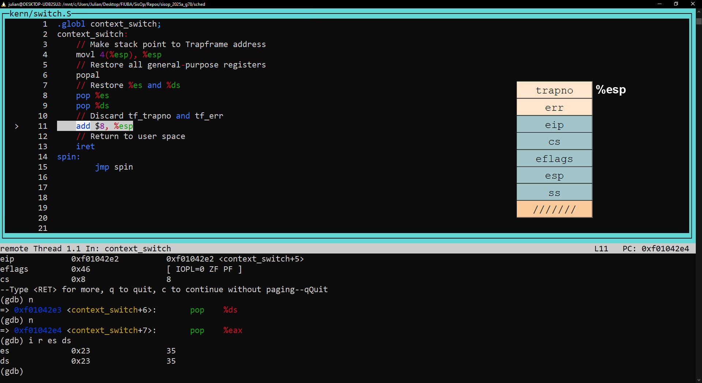

# sched

### Parte 1: Context switch

El cambio de contexto se produce en la función ```env_run```, en ```kern/env.c```.
Se puede ver el Trapframe del entorno en la imagen:


Una vez dentro de la función ```context_switch``` en x86:


Se "apunta" al struct Trapframe que recibió la función (es una dirección de memoria).
Luego de la instrucción, el stack "es" el struct.


Se restauran todos los registros de propósito general.
Para simplificar, se muestran ```eax```, ```ecx```, ```edx``` y ```ebx```, todos con
el valor esperado (en este caso 0).


Se restauran los registros ```es``` y ```ds```, ambos con el valor esperado (en este caso 35).


Se descartan los valores ```tf_trapno``` y ```err```, no necesarios para el switch.


Finalmente, se ejecuta ```iret``` y el switch termina de forma exitosa.
Los registros restantes tienen los valores esperados, principalmente:

1. ```eip```: 0x800020 (8388640 en base 10)
2. ```cs```: 27
3. ```esp```: 0xEEBFE000 (4005552128 en base 10)


### Parte 3: Scheduling con prioridades.

Se implementó una lógica sencilla emulando a Multi-Level Feedback Queue, y según el libro Three Easy Pieces (capítulo 8: `Scheduling: The Multi-Level Feedback Queue`) manteniendo algunas de sus reglas, y citamos:

• Rule 1: If Priority(A) > Priority(B), A runs (B doesn’t). 

Se cumple por razones lógicas, si no no seria un scheduling ponderativo respecto a la prioridad.

• Rule 2: If Priority(A) = Priority(B), A & B run in round-robin fash-
ion using the time slice (quantum length) of the given queue.

No se utiliza RR, de haber dos jobs con la misma prioridad se va a ejecutar el primero que se encuentre (porque se utiliza > (mayor estricto)).

• Rule 3: When a job enters the system, it is placed at the highest
priority (the topmost queue).

Cuando un job entra al sistema, se lo setea a una prioridad media, definida en nuestro caso como DEFAULT_PRIORITY = 20. 

• Rule 4: Once a job uses up its time allotment at a given level (re-
gardless of how many times it has given up the CPU), its priority is
reduced (i.e., it moves down one queue).

Acá se utiliza una regla similar: en una vez que se terminó de ejecutar en un time-slice un job, se le baja la prioridad en 1 (si es que ya no es lo misma).

• Rule 5: After some time period S, move all the jobs in the system
to the topmost queue.

Aca lo que se realiza es que despues de N (RUNS_UNTIL_UPGRADE = 40, en nuestro caso) ejecuciones del scheduler (similar a hacerlo con el tiempo directamente, ya que el tiempo seria N * t siendo t el tiempo del time slice), se llevan todas las prioridades a la máxima posible (MAX_PRIORITY = 39, en nuestro caso)