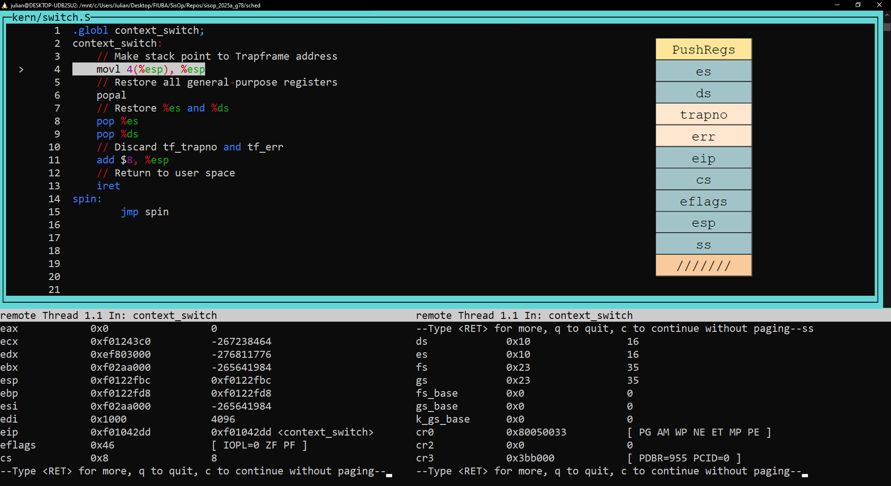

# sched

### Parte 1: Context switch

El cambio de contexto se produce en la función ```env_run```, en ```kern/env.c```.
Se puede ver el Trapframe del entorno en la imagen:


Una vez dentro de la función ```context_switch``` en x86:


Se "apunta" al struct Trapframe que recibió la función (es una dirección de memoria).
Luego de la instrucción, el stack "es" el struct.


Se restauran todos los registros de propósito general.
Para simplificar, se muestran ```eax```, ```ecx```, ```edx``` y ```ebx```, todos con
el valor esperado (en este caso 0).


Se restauran los registros ```es``` y ```ds```, ambos con el valor esperado (en este caso 35).


Se descartan los valores ```tf_trapno``` y ```err```, no necesarios para el switch.


Finalmente, se ejecuta ```iret``` y el switch termina de forma exitosa.
Los registros restantes tienen los valores esperados, principalmente:

1. ```eip```: 0x800020 (8388640 en base 10)
2. ```cs```: 27
3. ```esp```: 0xEEBFE000 (4005552128 en base 10)


### Parte 3: Scheduling con prioridades.

#### Implementación política

Se implementó una lógica sencilla haciendo una política similar a la de Multi-Level Feedback Queue, y según el libro Three Easy Pieces (capítulo 8: `Scheduling: The Multi-Level Feedback Queue`, página 10 del propio capítulo) manteniendo algunas de sus reglas, y citamos:

```
• Rule 1: If Priority(A) > Priority(B), A runs (B doesn’t).
```

Se cumple por razones lógicas, si no no seria un scheduling ponderativo respecto a la prioridad.

```
• Rule 2: If Priority(A) = Priority(B), A & B run in round-robin fashion using the time slice (quantum length) of the given queue.
```

No se utiliza RR, de haber dos jobs con la misma prioridad se va a ejecutar el primero que se encuentre (porque se utiliza > (mayor estricto)).

```
• Rule 3: When a job enters the system, it is placed at the highest priority (the topmost queue).
```

Cuando un job entra al sistema, se lo setea a una prioridad media, definida en nuestro caso como DEFAULT_PRIORITY = 20.

```
• Rule 4: Once a job uses up its time allotment at a given level (regardless of how many times it has given up the CPU), its priority is reduced (i.e., it moves down one queue)._
```

Acá se utiliza una regla similar: en una vez que se terminó de ejecutar en un time-slice un job, se le baja la prioridad en 1 (si es que ya no es lo misma).

```
• Rule 5: After some time period S, move all the jobs in the system to the topmost queue.
```

Aca lo que se realiza es que despues de N (`RUNS_UNTIL_UPGRADE = 40`, en nuestro caso (usamos 40 porque era justo lo que daba el intervalo de prioridades según la escala de CFS)) ejecuciones del scheduler (similar a hacerlo con el tiempo directamente, ya que el tiempo seria `N * t` siendo t el tiempo del time slice), se llevan todas las prioridades a la máxima posible (`MAX_PRIORITY = 39`, en nuestro caso)

#### Demostración de funcionamiento (Resultados de runnear el test user/setenvpriority)

Dejamos al final de este informe el resultado de ejecutar el test implementado para mostrar que el comportamiento del scheduler es el esperado

```
SMP: CPU 0 found 1 CPU(s)
enabled interrupts: 1 2
[00000000] new env 00001000
0xf014e3d8
[00000000] new env 00001001
0xf014e3d8
[00000000] new env 00001002
0xf014e3d8
[00000000] new env 00001003
0xf014e3d8
[00000000] new env 00001004
0xf014e3d8
[00000000] new env 00001005
0xf014e3d8
[00000000] new env 00001006
0xf014e3d8
[00000000] new env 00001007
0xf014e3d8
[00000000] new env 00001008
0xf014e3d8
[00000000] new env 00001009
0xf014e3d8
Hello, I am environment 00001001, cpu 0, priority 19
Hello, I am environment 00001002, cpu 0, priority 19
Hello, I am environment 00001003, cpu 0, priority 19
Hello, I am environment 00001004, cpu 0, priority 19
Hello, I am environment 00001005, cpu 0, priority 19
Hello, I am environment 00001006, cpu 0, priority 19
Hello, I am environment 00001007, cpu 0, priority 19
Hello, I am environment 00001008, cpu 0, priority 19
Hello, I am environment 00001009, cpu 0, priority 19
Hello, I am environment 00001000, cpu 0, priority 18
Back in environment 00001001, priority 18, cpu 0
Hello, I am environment 00001001, cpu 0, priority 18
Back in environment 00001002, priority 18, cpu 0
Back in environment 00001003, priority 18, cpu 0
Hello, I am environment 00001003, cpu 0, priority 18
Back in environment 00001004, priority 18, cpu 0
Hello, I am environment 00001004, cpu 0, priority 18
Back in environment 00001006, priority 18, cpu 0
Hello, I am environment 00001006, cpu 0, priority 18
Back in environment 00001007, priority 18, cpu 0
Hello, I am environment 00001007, cpu 0, priority 18
Back in environment 00001008, priority 18, cpu 0
Hello, I am environment 00001008, cpu 0, priority 18
Back in environment 00001009, priority 18, cpu 0
Hello, I am environment 00001009, cpu 0, priority 18
Back in environment 00001000, priority 17, cpu 0
Hello, I am environment 00001000, cpu 0, priority 17
Back in environment 00001001, priority 17, cpu 0
Hello, I am environment 00001001, cpu 0, priority 17
Hello, I am environment 00001002, cpu 0, priority 17
Back in environment 00001003, priority 17, cpu 0
Hello, I am environment 00001003, cpu 0, priority 17
Back in environment 00001004, priority 17, cpu 0
Hello, I am environment 00001004, cpu 0, priority 17
Back in environment 00001005, priority 17, cpu 0
Back in environment 00001006, priority 17, cpu 0
Hello, I am environment 00001006, cpu 0, priority 17
Back in environment 00001007, priority 17, cpu 0
Hello, I am environment 00001007, cpu 0, priority 17
Back in environment 00001008, priority 17, cpu 0
Hello, I am environment 00001008, cpu 0, priority 17
Back in environment 00001000, priority 16, cpu 0
Hello, I am environment 00001000, cpu 0, priority 16
Back in environment 00001001, priority 16, cpu 0
Hello, I am environment 00001001, cpu 0, priority 16
Back in environment 00001002, priority 16, cpu 0
Back in environment 00001003, priority 16, cpu 0
Hello, I am environment 00001003, cpu 0, priority 16
Back in environment 00001004, priority 16, cpu 0
Hello, I am environment 00001004, cpu 0, priority 16
Hello, I am environment 00001005, cpu 0, priority 16
Back in environment 00001006, priority 16, cpu 0
Hello, I am environment 00001006, cpu 0, priority 16
Back in environment 00001007, priority 16, cpu 0
Hello, I am environment 00001007, cpu 0, priority 16
Back in environment 00001008, priority 16, cpu 0
Hello, I am environment 00001008, cpu 0, priority 16
Back in environment 00001000, priority 38, cpu 0
Hello, I am environment 00001000, cpu 0, priority 38
Back in environment 00001001, priority 38, cpu 0
Hello, I am environment 00001001, cpu 0, priority 38
Hello, I am environment 00001002, cpu 0, priority 38
Back in environment 00001003, priority 38, cpu 0
Hello, I am environment 00001003, cpu 0, priority 38
Back in environment 00001004, priority 38, cpu 0
Hello, I am environment 00001004, cpu 0, priority 38
Back in environment 00001005, priority 38, cpu 0
Hello, I am environment 00001005, cpu 0, priority 38
Back in environment 00001006, priority 38, cpu 0
Hello, I am environment 00001006, cpu 0, priority 38
Back in environment 00001007, priority 38, cpu 0
Hello, I am environment 00001007, cpu 0, priority 38
Back in environment 00001009, priority 38, cpu 0
Hello, I am environment 00001009, cpu 0, priority 38
Back in environment 00001000, priority 37, cpu 0
Hello, I am environment 00001000, cpu 0, priority 37
Back in environment 00001001, priority 37, cpu 0
Get env priority: 37
Set env priority: 34
Back in environment 00001002, priority 37, cpu 0
Hello, I am environment 00001002, cpu 0, priority 37
Back in environment 00001003, priority 37, cpu 0
Get env priority: 37
Set env priority: 34
New priority: 34
[00001003] exiting gracefully
[00001003] free env 00001003
Back in environment 00001004, priority 37, cpu 0
Get env priority: 37
Set env priority: 34
Back in environment 00001006, priority 37, cpu 0
Get env priority: 37
Set env priority: 34
New priority: 34
[00001006] exiting gracefully
[00001006] free env 00001006
Back in environment 00001007, priority 37, cpu 0
Get env priority: 37
Set env priority: 34
New priority: 34
[00001007] exiting gracefully
[00001007] free env 00001007
Back in environment 00001009, priority 37, cpu 0
Hello, I am environment 00001009, cpu 0, priority 37
Back in environment 00001000, priority 36, cpu 0
Get env priority: 36
Set env priority: 33
New priority: 33
[00001000] exiting gracefully
[00001000] free env 00001000
Back in environment 00001002, priority 36, cpu 0
Hello, I am environment 00001002, cpu 0, priority 36
Back in environment 00001005, priority 36, cpu 0
Hello, I am environment 00001005, cpu 0, priority 36
Back in environment 00001002, priority 35, cpu 0
Get env priority: 35
Set env priority: 32
Back in environment 00001005, priority 35, cpu 0
Hello, I am environment 00001005, cpu 0, priority 35
Back in environment 00001009, priority 35, cpu 0
Hello, I am environment 00001009, cpu 0, priority 35
Back in environment 00001005, priority 34, cpu 0
Get env priority: 34
Set env priority: 31
New priority: 31
[00001005] exiting gracefully
[00001005] free env 00001005
Back in environment 00001009, priority 34, cpu 0
Get env priority: 34
New priority: 34
[00001001] exiting gracefully
[00001001] free env 00001001
New priority: 34
[00001004] exiting gracefully
[00001004] free env 00001004
Set env priority: 31
New priority: 31
[00001009] exiting gracefully
[00001009] free env 00001009
New priority: 31
[00001002] exiting gracefully
[00001002] free env 00001002
Back in environment 00001008, priority 15, cpu 0
Hello, I am environment 00001008, cpu 0, priority 15
Back in environment 00001008, priority 15, cpu 0
Get env priority: 15
Set env priority: 12
New priority: 12
[00001008] exiting gracefully
[00001008] free env 00001008
No runnable environments in the system!
Scheduler history:
Env ID: 4099; sched runs: 6; initial run: 4; final run: 52; env runs: 33
Env ID: 4102; sched runs: 6; initial run: 7; final run: 55; env runs: 33
Env ID: 4103; sched runs: 6; initial run: 8; final run: 56; env runs: 33
Env ID: 4096; sched runs: 7; initial run: 1; final run: 58; env runs: 34
Env ID: 4101; sched runs: 9; initial run: 6; final run: 65; env runs: 36
Env ID: 4097; sched runs: 7; initial run: 2; final run: 67; env runs: 34
Env ID: 4100; sched runs: 7; initial run: 5; final run: 68; env runs: 34
Env ID: 4105; sched runs: 9; initial run: 10; final run: 69; env runs: 36
Env ID: 4098; sched runs: 9; initial run: 3; final run: 70; env runs: 36
Env ID: 4104; sched runs: 8; initial run: 9; final run: 74; env runs: 35
Total runs: 75
```

Si se observa los IDs de los jobs y se van viendo los mensajes `Hello, I am environment x, cpu y, priority 19` que es el mensaje inicial (y se imprime una vez ya se runneo por primera vez el job) y `Back in environment x, priority 18, cpu y` que es cuando se vuelve al job, se puede ver que se volvió a ejecutar el job del mismo ID y que su prioridad disminuyó. Tambien luego de las 40 ejecuciones se ve que los jobs arrancan a tener una priority de 39 (realmente se ve con los prints 38 porque ya se ejecutó el job para cuando se llega al print).

Sumado a eso si se hace `ctrl + f` se puede ver que la cantidad de ejecuciones del job coinciden con lo mostrado en el mensaje de history_scheduler en el campo de sched_runs, y que la suma de los sched_runs de todos los procesos da igual al `total_runs - 1` (el -1 porque la ultima vez que se ejecuta el scheduler no encuentra ningun job disponible para ejecutar).

Luego la diferencia que se ve en cada job entre sched_runs y env_runs es porque el proceso también es ejecutado por y desde el trapframe (si en el directorio tocamos `ctrl + shift + f` y ponemos `env_run` podemos ver el llamado desde trap.c)